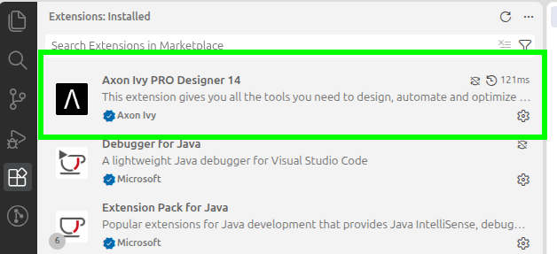
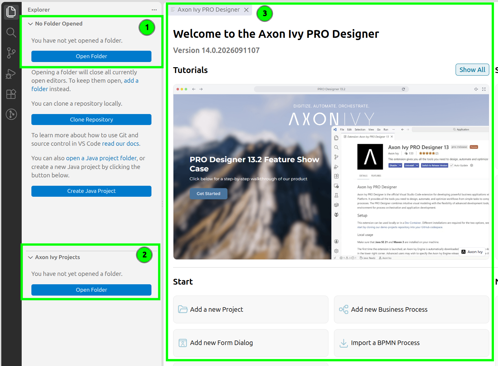
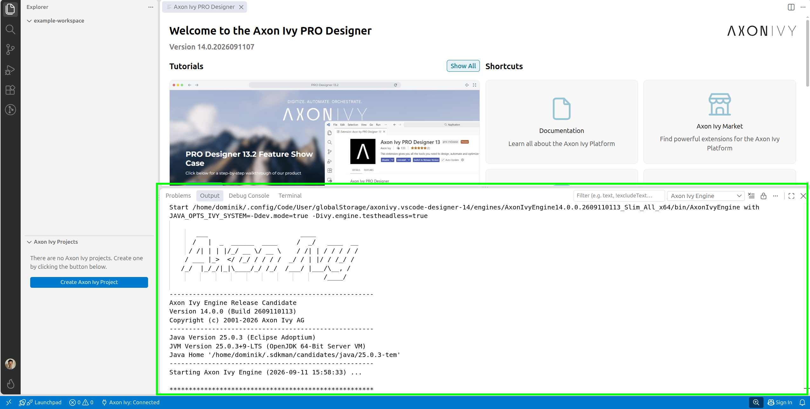
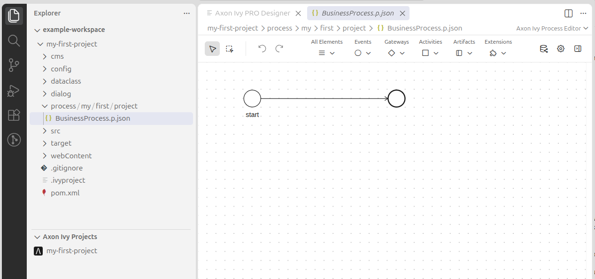

First Steps
===========

Check the installation
----------------------

After installing the Designer extension, your VS Code extension view should show the Axon Ivy Designer extension installed.

As mentioned before, there are almost always two ways to achieve something in VS Code: By clicking or by executing the command.

To bring up the VS Code extension view, you can either

#. Click the Extension View icon in the activity bar on the very left.
#. Open the Command Palette via ``Ctrl+Shift+P`` and serach for the command ``View: Show Extensions``.

    Axon Ivy extension is installed in the extension view

Opening a workspace
-------------------

After the start, the window will probably look similar to this

    VS Code without an open workspace

1. This is the File Explorer View that shows the folders and files in your workspace. Since we have not yet opened a workspace, it is empty.
2. The Axon Ivy Projects view also tells you that there are no Axon Ivy projects in your workspace.
3. The Welcome page of the Designer extension is always shown upon start.

We can create an empty folder `example-workspace` and use the ``Open Folder`` button in the file explorer to open it. Alternatively, we can open the Command Palette and execute the command ``File: Open Folder...``.

This sets our VS Code workspace to that folder, which is now visible in the file browser view in the top left.

At this point, there is still no Axon Ivy project in our workspace, but the extension will automatically download and start the Axon Ivy Engine.
This is shown in the ``Output`` tab.
We are now ready to create an Axon Ivy project.

    Workspace with an open folder and no Axon Ivy projects

Adding an Axon Ivy project
--------------------------

We can now create our first Axon Ivy project within the opened workspace. To do so, click either on the add button ``Create Axon Ivy Project`` in the bottom left Axon Ivy Projects view or execute the command ``Axon Ivy: New Project``.
This will open a dialog in the top middle. Enter a name, for example ``my-first-project``
and hit enter. For step 2 and 3, we dialog proposes a default namespace and gropu ID which you can accept by hitting enter twice.

    Creation of the first Axon Ivy project

This will create an Axon Ivy project called ``my-first-project``. By default, there is a simple process created and the Process Editor opens to display the new process.
The file explorer shows you this folder in the workspace with all the files that make up the project.
The Axon Ivy Projects view also displays the project.
At this point, you have successfully set up the Axon Ivy Designer and are ready to design your processes.
